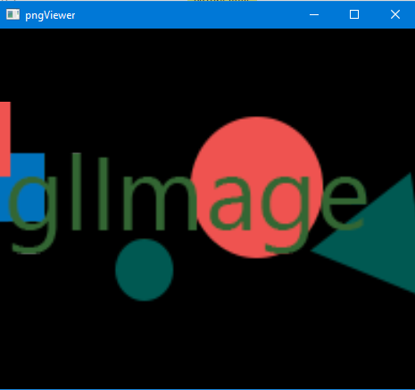

# pngViewer
[](https://travis-ci.org/RaghavaDhanya/pngViewer)
[](https://github.com/RaghavaDhanya/pngViewer/blob/master/LICENSE)
> Demo: Using PNG images as textures in openGL

### Lodepng 
here is the link to [lodepng](http://lodev.org/lodepng/)
 
### Prerequisites
* freeglut

you can install it in ubuntu using
```
sudo apt-get freeglut3-dev
```

### Compile
linux users can use compile.sh to compile
& run it as
```
./pngViewer <image path>
```
use arrow keys to move & +,- for zooming
 
### Screenshots


### License
This project is under MIT license, see the [LICENSE](LICENSE) file for details
